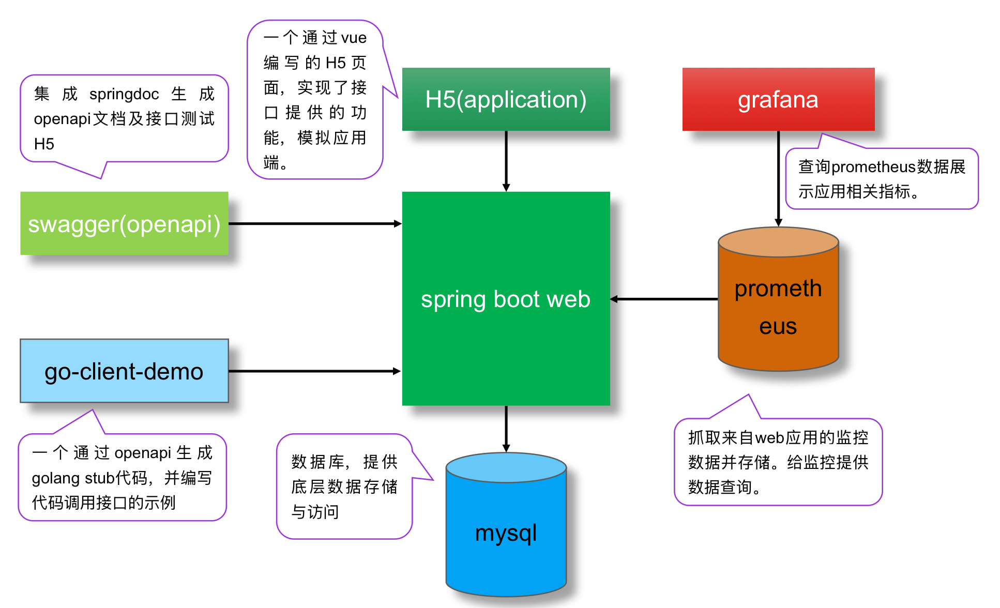
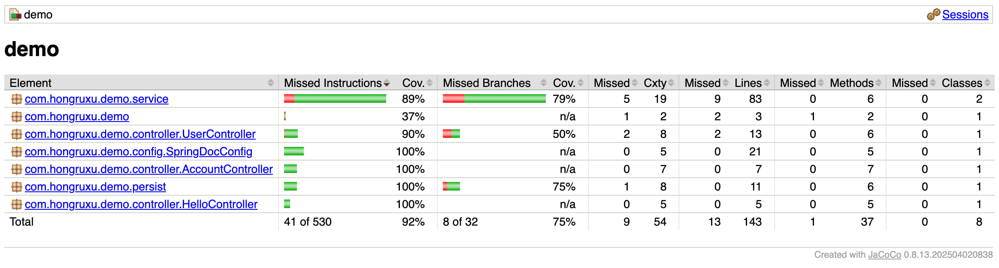

# 这是一个简单的基于Spring boot 的 Java Web 项目。

## 功能说明
- 目前通过spring boot + Springdoc + mybatis 实现了一个简单的增删改查操作示例
- hello模块：一个简单的读写操作，后端是一个用map实现的简单内存数据块。服务重启内容丢失
- user模块：一个利用 mybatis 实现的简单的读写DB功能
- account模块：一个基于DB实现的简单的模拟账户之间互转的功能
- [主要功能演示](http://114.132.58.71:9999/test/index.html)(vue封装接口实现)
- [openapi协议文档](http://114.132.58.71:9999/swagger-ui/index.html)
- [系统监控演示](http://114.132.58.71:3000/d/X034JGT7Gz) 用户名：admin, 密码：micMIC123
- [系统监控原始指标源](http://114.132.58.71:9999/actuator)
- [golang通过openapi调用示例](https://github.com/hongruxu/openapi-client-go-demo)

## 架构简图


## 部署方法
1. 采用机器直接部署的方式，前提条件需要建好数据库表和一台装有JDK的机器
2. 修改代码对应的数据库连接配置 (resources/application.yml)
3. 修改copy_to_test.sh脚本中的机器IP，部署目录等
4. 执行copy_to_test.sh，中间会需要交互输出密码，如在机器装上ssh key，可免密部署

## 说明
- 本代码只为演示基本功能，未考虑安全和一些运营标准。
- 配置中的数据库密码等名文提交也是不符合运营标准的，需要有另外的方法或是相应的平台管理密码
- 示例代码逻辑轻，有些没有单独做service层
- 异常处理未做标准化处理，后续待完善
- 代码后台数据库为腾讯云上mysql,因一些权限原因，采用外网地址连接，生产中应该避免。

## 开发总结
- 本代码为学习Java spring boot的演示代码，代码的完善过程也是一个学习的过程。
- 技术栈维度上的演进过程：从最开始跑通的hello模块，到引入数据库访问，再到增加一些简单的业务逻辑功能引入事务，逐步深入编写一个有“功能”的示例代码。因为引入openapi也用go语言验证了不同语言快速调用接口的使用方式。
- 产品体验维度上的演进：从最开始能在浏览器中访问服务，到引入srpingdoc可以通过界面测试接口。再到通过前端技术整合接口实现一个可体验的“产品”。
- 运维及CI/CD维度上的演进：从最开始能在本地跑起来，到通过脚本一键部署到测试机器，再到引入promethus+grafana整合一个可观察监控平台。以及增加测试用例。方便代码自测。
  
## change log 
### 2025-09-26
- 通过 spring boot创建项目
- 引入 springdoc 生成openapi文档
- 引入 mybatis 及 mysql 组件，读取远程数据库
- 目前未对异常做处理，只是简单跑通逻辑
- 有一些问题待查，比如Bean的Getter/Setter方法通过注解方式在IDE内测试时没问题，但打包发布时Schema会为空。

### 2025-09-27
- 实现了一个简单的转账逻辑,为了验证事务，当转账金额为99是会写一半抛异常。验证数据一致性。
- 目前没有相应的环境，写了Dockerfile还没验证，
- 为了方便部署，写了一个脚本简单用scp部署到机器验证，出于安全考虑，脚本是交互式的，需要手工输入密码
- 文档按 hello/ user/ account功能进行了分组展示
- 完善了一些转账逻辑
- 优化了Mapper注解的写法，调整了一些业务逻辑
- 解决了通过lombok注解在发布包中无法使用的问题

### 2025-09-28
- 用 promethus+grafana 把服务相关信息监控起来
- 做了一个Result类封装返回结构。

### 2025-09-29
- 用openapi文档生成go语言的stub,并完成一个简单的请求，示例代码见项目[openapi-client-go-demo](https://github.com/hongruxu/openapi-client-go-demo)

### 2025-09-30
- 用 vue 简单的实现了调用接口的页面，便于测试接口和演示功能
- 转账逻辑封装了一层service

### 2025-10-01
- 对封装的Result类的输出结构由Object类改为泛型，文档内容可读性更高。

### 2025-10-08
- 完善测试，针对3个模块，分别做了测试用例
- 增加测试覆盖率报告(./mvnw clean test & ./mvnw jacoco:report 后在target/site/jacoco/index.html生成报告)



## 数据库定义

### account 账户表，只有账号和余额，为方便账号通过自增生成
```sql
CREATE TABLE `account` (
  `account_id` int NOT NULL AUTO_INCREMENT,
  `balance` bigint NOT NULL DEFAULT '0',
  `update_time` datetime DEFAULT CURRENT_TIMESTAMP,
  PRIMARY KEY (`account_id`)
) ENGINE=InnoDB AUTO_INCREMENT=10000 DEFAULT CHARSET=utf8mb4  
-- 为了让产生的账号长一些这里自增从10000开始
```

### transfer_flow 转账流水表，记录转账时双方账号，转账金额及转账后各自余额
```sql
CREATE TABLE `transfer_flow` (
  `id` bigint NOT NULL AUTO_INCREMENT,
  `from_account` int NOT NULL DEFAULT '0',
  `to_account` int NOT NULL DEFAULT '0',
  `amount` int NOT NULL DEFAULT '0',
  `from_balance` int NOT NULL DEFAULT '0',
  `to_balance` int NOT NULL DEFAULT '0',
  `op_time` datetime DEFAULT CURRENT_TIMESTAMP,
  PRIMARY KEY (`id`),
  KEY `from_to_account` (`from_account`,`to_account`)
  KEY `to_from_account` (`to_account`,`from_account`)
) ENGINE=InnoDB  DEFAULT CHARSET=utf8mb4
```

### user 一个普通的用户资料表，仅演示读写操作
```sql
CREATE TABLE `user` (
  `id` int NOT NULL AUTO_INCREMENT,
  `user_name` varchar(50) NOT NULL DEFAULT '',
  `age` int NOT NULL DEFAULT 0,
  `email` varchar(100) NOT NULL DEFAULT '',
  PRIMARY KEY (`id`),
  UNIQUE KEY `username` (`username`)
) ENGINE=InnoDB  DEFAULT CHARSET=utf8mb4 
```

## 问题解决
1. lombok 无法正常使用，需要在pom.xml中对build部分进行设置,正确设置如下，如果通过spring boot 工具自动生成，是没有maven这一节的，也没有关于lombok的相关配置
```xml
	<build>
		<plugins>
			<plugin>
				<groupId>org.apache.maven.plugins</groupId>
				<artifactId>maven-compiler-plugin</artifactId>
				<configuration>
					<annotationProcessorPaths>
						<path>
							<groupId>org.projectlombok</groupId>
							<artifactId>lombok</artifactId>
						</path>
					</annotationProcessorPaths>
				</configuration>
			</plugin>
			<plugin>
				<groupId>org.springframework.boot</groupId>
				<artifactId>spring-boot-maven-plugin</artifactId>
				<configuration>
					<excludes>
						<exclude>
							<groupId>org.projectlombok</groupId>
							<artifactId>lombok</artifactId>
						</exclude>
					</excludes>
				</configuration>
			</plugin>
		</plugins>
	</build>
```
